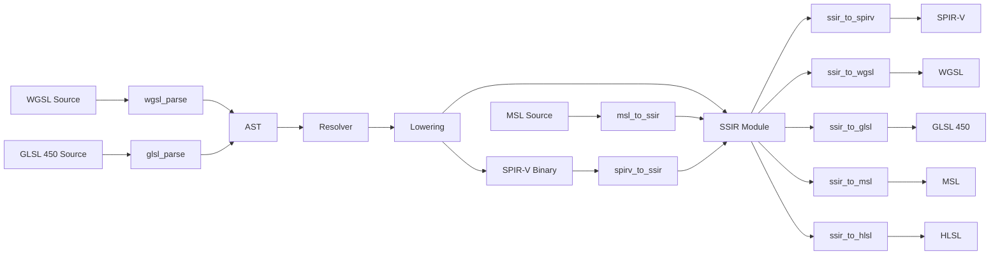

# Simple WGSL

A feature-complete shader compiler library written in pure C99. Converts between **WGSL**, **GLSL 450**, **MSL**, **HLSL**, and **SPIR-V** through a shared intermediate representation.

```
WGSL ──┐              ┌── SPIR-V
GLSL ──┤              ├── WGSL
MSL  ──┼── [SSIR] ──┼── GLSL 450
SPIR-V ┘              ├── MSL
                       └── HLSL
```

### Why Simple WGSL?

- **Single header, zero dependencies** -- include `simple_wgsl.h` and link the static library. No runtime dependencies beyond the C standard library.
- **Six languages, one pipeline** -- parse WGSL, GLSL, or MSL source; ingest SPIR-V binaries; emit to any of five output formats. Every conversion flows through the same intermediate representation.
- **~30k lines of C99** -- no templates, no inheritance hierarchies, no build system complexity. Every compilation unit is a single `.c` file. Builds in under a second.
- **Embeddable** -- all memory allocation goes through overridable macros (`NODE_MALLOC`, `SSIR_MALLOC`, etc.), so you can plug in your own allocator for game engines, embedded systems, or WASM targets.
- **Fuzz-hardened** -- eight libFuzzer targets with AddressSanitizer + UndefinedBehaviorSanitizer have been run continuously.

### Quick Start

```c
#include "simple_wgsl.h"
#include <stdio.h>

int main(void) {
    // Parse WGSL source
    const char *src =
        "@vertex fn main(@builtin(vertex_index) idx: u32) -> @builtin(position) vec4f {\n"
        "    return vec4f(0.0, 0.0, 0.0, 1.0);\n"
        "}\n";

    WgslAstNode *ast = wgsl_parse(src);
    WgslResolver *resolver = wgsl_resolver_build(ast);

    // Compile to SPIR-V
    WgslLowerOptions opts = {0};
    opts.env = WGSL_LOWER_ENV_VULKAN_1_2;
    opts.enable_debug_names = 1;

    uint32_t *spirv;
    size_t word_count;
    WgslLowerResult res = wgsl_lower_emit_spirv(ast, resolver, &opts, &spirv, &word_count);

    if (res == WGSL_LOWER_OK)
        printf("Generated %zu SPIR-V words\n", word_count);

    wgsl_lower_free(spirv);
    wgsl_resolver_free(resolver);
    wgsl_free_ast(ast);
}
```

### Building

Compile directly without a build system (requires [SPIR-V Headers](https://github.com/KhronosGroup/SPIRV-Headers) installed):

```bash
cc -c *.c -I/path/to/SPIRV-Headers/include
ar rcs libsimple_wgsl.a *.o
```

Or use CMake (3.16+), which fetches SPIR-V Headers automatically if not found on the system:

```bash
cmake -B build -G Ninja
ninja -C build
```

Run the tests (requires Google Test, fetched automatically):

```bash
cmake -B build -G Ninja -DWGSL_BUILD_TESTS=ON
ninja -C build
ctest --test-dir build --output-on-failure
```

Build options (All testing/debugging related):

| Option | Default | Description |
|--------|---------|-------------|
| `WGSL_BUILD_TESTS` | `ON` | Build Google Test suite |
| `WGSL_BUILD_EXPRESSION_TESTS` | `OFF` | Build golden-file expression tests (needs `expressions/` data) |
| `WGSL_BUILD_FUZZ` | `OFF` | Build libFuzzer fuzz targets |
| `WGSL_BUILD_EGL_TESTS` | `OFF` | Build EGL/OpenGL compute validation tests |
| `WGSL_BUILD_METAL_EXAMPLES` | `OFF` | Build Metal/MSL examples (macOS only) |
| `WGSL_USE_ASAN` | `OFF` | Enable AddressSanitizer |

### Architecture



SSIR (Simple Shader Intermediate Representation) sits at the center. All source languages parse into it, all output formats emit from it. See [TECHNICAL.md](TECHNICAL.md) for the full architecture deep-dive.

### Source Files

| File | Lines | Purpose |
|------|-------|---------|
| `simple_wgsl.h` | 1624 | Unified public API header |
| `wgsl_parser.c` | 1956 | WGSL lexer + recursive-descent parser |
| `glsl_parser.c` | 2153 | GLSL 450 lexer + recursive-descent parser |
| `msl_parser.c` | 2159 | MSL lexer + parser (produces SSIR directly) |
| `wgsl_resolve.c` | 1020 | Semantic analysis and symbol resolution |
| `wgsl_lower.c` | 5826 | AST to SSIR to SPIR-V compilation |
| `wgsl_raise.c` | 2121 | SPIR-V to WGSL decompilation |
| `ssir.c` | 2959 | SSIR module, type system, and builder API |
| `ssir_to_spirv.c` | 2653 | SSIR to SPIR-V serialization |
| `ssir_to_wgsl.c` | 1689 | SSIR to WGSL text emission |
| `ssir_to_glsl.c` | 1728 | SSIR to GLSL 450 text emission |
| `ssir_to_msl.c` | 2131 | SSIR to Metal Shading Language emission |
| `ssir_to_hlsl.c` | 1367 | SSIR to HLSL emission |
| `spirv_to_ssir.c` | 2482 | SPIR-V to SSIR deserialization |

### Documentation

- **[TECHNICAL.md](TECHNICAL.md)** -- Architecture, SSIR specification, full API reference, type system, instruction set, and internal design details.
- **[TUTORIAL.md](TUTORIAL.md)** -- Step-by-step guides for every major use case: parsing, compiling, decompiling, cross-compiling, building the SSIR programmatically, custom allocators, and more.

### Dependencies

| Dependency | Version | Source |
|-----------|---------|--------|
| SPIR-V Headers (Khronos) | vulkan-sdk-1.4.341 | System or FetchContent |
| Google Test | v1.14.0 | FetchContent (tests only) |
| Vulkan SDK | system | Optional, for GPU tests |
| `spirv-val` / `spirv-dis` | system | Optional, SPIRV-Tools for test validation |

### License

See [LICENSE](LICENSE).
